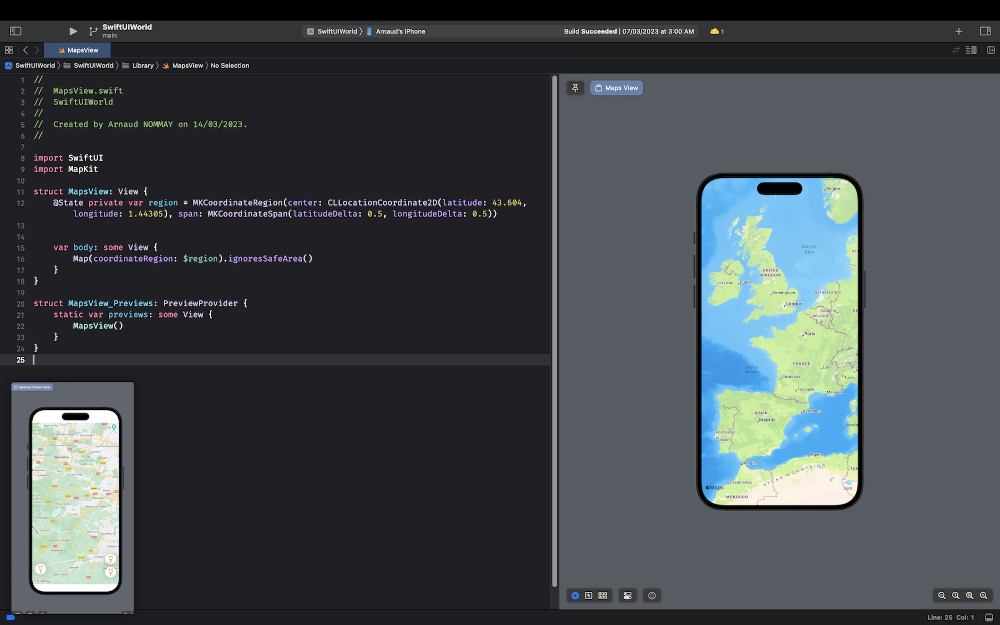

# PiPify

 

PiPify is a macOS application available on the App Store that allows you to put any image or document in Picture in Picture mode. This feature allows you to keep an image in the foreground, making it practical for developers, gamers, or any other productivity activity.

# Download

You can download PiPify from the App Store on your macOS device.

# Features

- Put any image or document in Picture in Picture mode
- Keep an image in the foreground for easy access
- Resize and reposition the image as needed

# How to Use

Below are some screenshots of Pipify in action. The app's user interface is designed to be simple and intuitive, making it easy for users to quickly start using the Picture in Picture mode. 

In this screenshot, you can see Pipify being used to display an image in Picture in Picture mode. The user has chosen to position the window in the bottom left corner of the screen, allowing them to continue working on other tasks while keeping the image in view.

This screenshot shows Pipify being used to display a app screenshot in Picture in Picture mode. While codding in Xcode in full screen mode

In this final screenshot, you can see the Pipify used by player to show usefull image in full screen game mode. Very usefull !

We hope these screenshots give you a good idea of what Pipify can do.

# Technologies Used

Swiftui

## Contributing

We welcome contributions from anyone who is interested in helping to improve Pipify. If you would like to contribute, please follow these steps:

1. Fork the repository and clone it to your local machine.
2. Make your changes and test them thoroughly.
3. Push your changes to your forked repository.
4. Submit a pull request, detailing the changes you made and why you made them.

Before submitting a pull request, please ensure that your changes are in line with the goals of the project and do not conflict with existing features.

## License

PiPify is licensed under the MIT License. See LICENSE for more information.

## Support

If you have any issues or questions about PiPify, please ask question on App Store comments.
